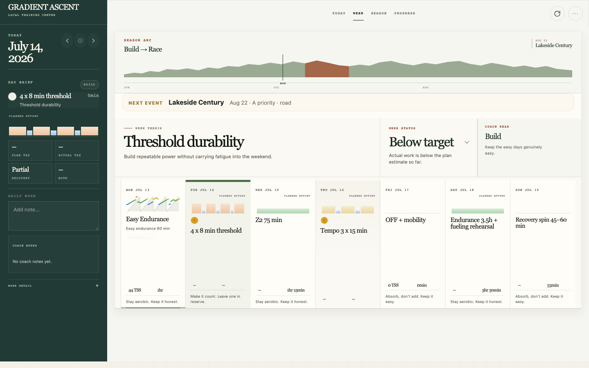
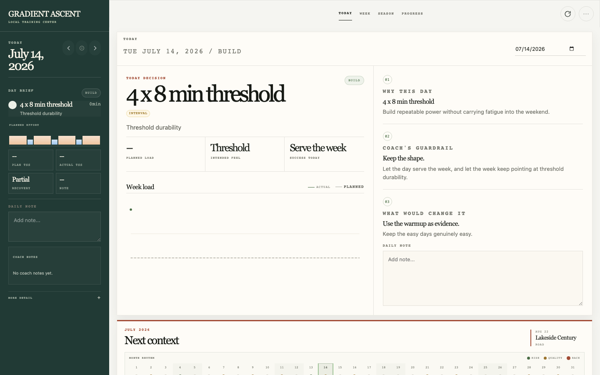
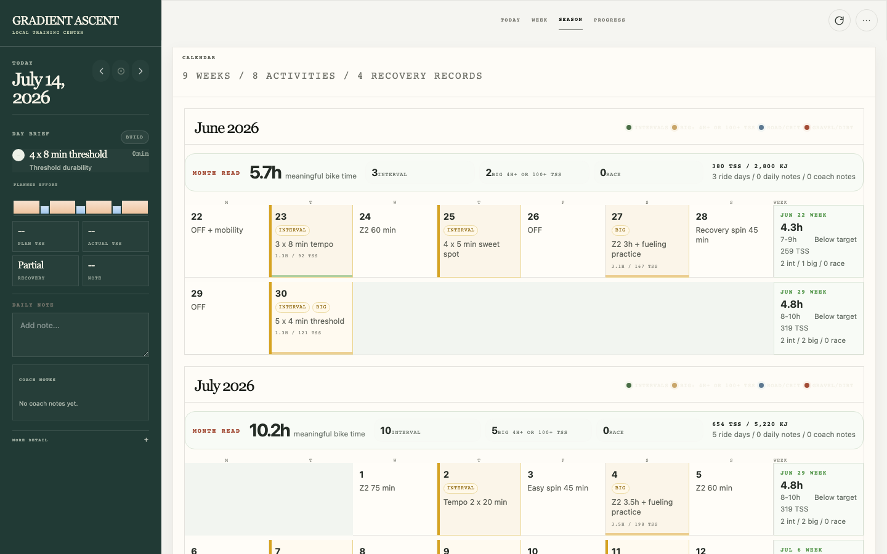

# Gradient Ascent

Gradient Ascent is a local-first cycling coach for Codex. It turns a rider's goals, events, training plan, activity history, and recovery exports into a private coaching workspace and a localhost Training Center.

The project is cycling-first. Setup stays conversational: the rider gives Codex one reusable setup prompt, then Codex asks one useful question at a time and records the answers in structured local files. A newly installed plugin requires one new Codex task before onboarding continues.

## Training Center



<p align="center">
  
  
</p>

<p align="center"><sub>Today, Week, and Season views shown with synthetic demo data.</sub></p>

## What it supports

- rider profile, availability, constraints, goals, and priority events
- training-plan import from CSV or XLSX
- official Strava account archives, including local FIT, TCX, and GPX parsing
- official Garmin Connect account exports for recovery history
- Apple Health `export.xml` for workouts and recovery signals
- optional provider-neutral activity and recovery sync through local companion manifests
- local weekly, daily, and activity summaries
- a localhost Training Center with notes, source status, refresh, and archive upload
- persistent coach notes and multi-perspective coaching advice

All source ingestion is file-based. Gradient Ascent does not request provider passwords, API keys, session cookies, MFA codes, or OAuth tokens.

## Requirements

- Python 3.11 or newer
- Codex Desktop or a Codex CLI build with local plugin support
- a separate private directory for athlete data

## Install

Clone the repository, then install from the checkout:

```bash
git clone https://github.com/rjmarsan/gradient-ascent.git
cd gradient-ascent
python3 -m venv .venv
.venv/bin/python -m pip install --require-hashes -r requirements-build.lock
.venv/bin/python -m pip install --require-hashes -r requirements.lock
.venv/bin/python -m pip install --no-build-isolation --no-deps -e .
scripts/install-local-plugin.sh
```

Start a new Codex task after installation, then paste the prompt from [SETUP_PROMPT.md](SETUP_PROMPT.md). The setup flow creates a private workspace at the path you choose, defaulting to `~/code/gradient-ascent-workspace`.

For the underlying commands and troubleshooting, see [INSTALL.md](INSTALL.md).

## Coaching conversations

The Gradient Ascent checkout installs the application; your separate private athlete
workspace is where coaching conversations belong. After setup, add or open that
existing workspace folder as its own project in Codex Desktop, then start a new task
there. You do not need to create another Git repository. Keep athlete files out of the
public Gradient Ascent repository and never publish the private workspace.

Ask for coaching naturally, or invoke an installed skill directly:

```text
$coach-advice what should I do today based on my training, recovery, and goals?
$gradient-ascent-goals help me update my priorities for the rest of this season.
$coach-note save the main takeaway from this ride discussion.
```

The Training Center's **Ask Coach** button opens a new Codex conversation scoped to
the same private athlete workspace. Saved coach notes can link back to the
conversation where an insight originated. Plugin skills become available in a new
Codex task after installation.

## Manual quick start

```bash
.venv/bin/gradient-ascent init-workspace ~/code/gradient-ascent-workspace
cd ~/code/gradient-ascent-workspace
.codex/bin/gradient-ascent onboarding-status --json
.codex/bin/gradient-ascent refresh
.codex/bin/gradient-ascent serve-training-center
```

The server binds to `127.0.0.1` only. It prints the exact URL and a workspace ID at startup.

## Import data

### Strava

Request the official account archive from [Strava's account download page](https://www.strava.com/athlete/download_my_account), then use either the Training Center upload control or the CLI:

```bash
.codex/bin/gradient-ascent import-strava-export ~/Downloads/strava-export.zip
```

The importer accepts a ZIP, an extracted export directory, or `activities.csv`. Referenced FIT, TCX, and GPX recordings are parsed locally into normalized streams and laps when present.

You can also import standalone `.fit`, `.tcx`, or `.gpx` ride files before the dashboard exists:

```bash
.codex/bin/gradient-ascent import-activity-recording ~/Downloads/ride.fit
```

Or drag them anywhere on the Training Center page. Both paths store them in the private athlete workspace, parse their ride summary, streams, and laps, and deduplicate repeat imports by file content.

### Garmin Connect

Download and unzip an official Garmin Connect account export, then point Gradient Ascent at the directory that contains `DI_CONNECT`:

```bash
.codex/bin/gradient-ascent import-garmin-export ~/Downloads/garmin-export
```

This path reads local export files only. It does not log in to Garmin or create a token store.

### Apple Health

Export health data from the Health app, unzip the export if needed, then provide either the export directory or `export.xml`:

```bash
.codex/bin/gradient-ascent import-apple-health-export ~/Downloads/apple_health_export/export.xml
```

### Optional companion sync

A separate companion can sync activity or recovery data and write a versioned, provider-neutral JSON manifest to your private athlete workspace. Gradient Ascent imports that local file and rebuilds its existing coaching data:

```json
{
  "version": 1,
  "provider": { "id": "ride-service", "label": "Ride Service" },
  "synced_at": "2026-07-12T08:35:00Z",
  "activities": [
    {
      "id": "example-ride-1",
      "date": "2026-07-12",
      "start_date_local": "2026-07-12T07:30:00",
      "sport_type": "Ride",
      "moving_time_s": 3600,
      "distance_m": 24000
    }
  ],
  "recovery": []
}
```

```bash
.codex/bin/gradient-ascent import-sync-manifest /path/to/manifest.json
.codex/bin/gradient-ascent refresh
```

Companions are optional and installed separately. They own any provider authentication and network access; Gradient Ascent does not bundle unofficial connectors, make provider network requests, or accept provider credentials. Imported companion manifests stay in the athlete workspace's Git-ignored `integrations/` directory. Keep them private and out of model context because they can contain personal activities, location, or health data.

### Training plan

```bash
.codex/bin/gradient-ascent build-plan plan.xlsx
```

The plan builder accepts the shipped weekly matrix format and daily rows with at least `Date` and `Workout` columns. See [the weekly example](examples/calendar/sample-training-calendar.csv) and [the daily example](examples/calendar/sample-daily-plan.csv). An unrecognized file fails without replacing the current plan. The prompt flow can also record that the rider has no existing plan and continue without one.

## Refresh behavior

The Training Center refresh button re-imports configured Apple Health and Garmin export paths, rebuilds canonical records and coaching summaries, and regenerates the dashboard. Strava history advances when the rider uploads or imports a newer official archive. Optional companion data appears after importing its latest local sync manifest and refreshing; Gradient Ascent does not initiate provider sync itself.

## Workspace boundary

The plugin checkout contains code, skills, documentation, and non-athlete examples. Athlete data belongs in the separate workspace. Its generated `.gitignore` excludes raw archives, GPS streams, health exports, imported companion manifests, logs, and `.env`.

Important workspace directories:

```text
plan/                 rider profile, goals, events, plan, and coach notes
strava/               normalized Strava history, laps, and streams
recordings/            normalized loose-file activities, laps, and streams
garmin/               normalized Garmin recovery days
apple_health/         normalized Apple Health workouts and recovery
integrations/         Git-ignored imported companion sync manifests
connections/          non-secret local import configuration
canonical/            source-normalized records
derived/              summaries and Training Center assets
imports/              private source archives and files
```

See [docs/privacy.md](docs/privacy.md) and [docs/data-model.md](docs/data-model.md) for the detailed boundary.

## Development

Run the test suite with the standard library runner:

```bash
.venv/bin/python -m unittest discover -s tests -v
```

Runtime and build dependencies are version-pinned in [pyproject.toml](pyproject.toml) and hash-locked in `requirements.lock` and `requirements-build.lock`. Regenerate reviewed locks with:

```bash
uv pip compile requirements.txt --universal --generate-hashes --output-file requirements.lock
uv pip compile requirements-build.in --universal --generate-hashes --output-file requirements-build.lock
```

## License

MIT. See [LICENSE](LICENSE).
